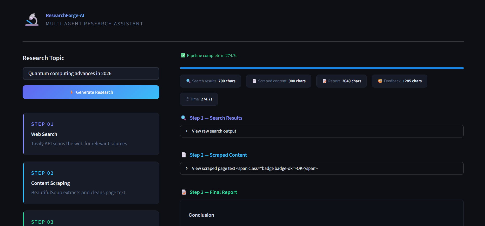
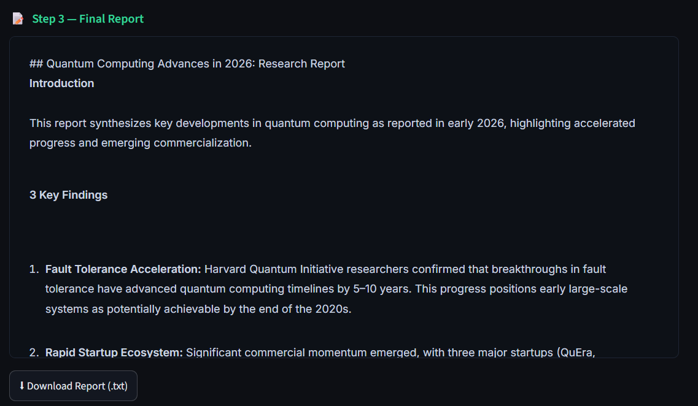
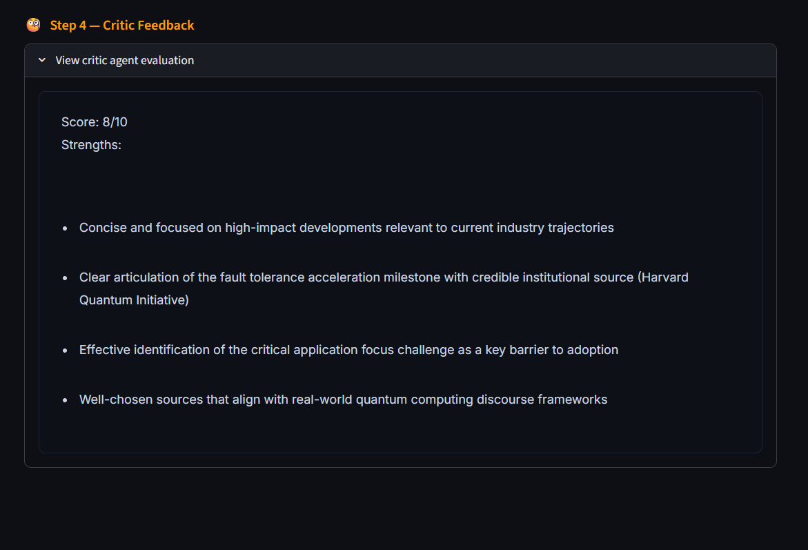

# 🔬 ResearchForge-AI

A multi-agent AI research assistant built using LangChain, Ollama (qwen3:4b), and Streamlit that performs intelligent web research, analysis, and report generation using a modular agent pipeline.

## Features

*  Multi-agent architecture (Planner, Researcher, Critic, Reporter)
* Live web search integration (Tavily + BeautifulSoup)
* Local LLM support via Ollama (qwen3:4b)
* Structured research report generation
* Self-refining critic agent loop
* Interactive Streamlit UI

## Tech Stack

* Python
* LangChain
* Ollama (Qwen3:4B)
* Tavily API
* BeautifulSoup
* Streamlit

## Project Architecture

User Query

↓

Planner Agent

↓

Research Agent(Web + Tools)

↓

Critic Agent(Validation + Feedback)

↓

Final Report(Final Output)

↓
Streamit UI output


## Project Structure

```text
ResearchForge-AI/
│
├── assets/
├── app.py
├── agents.py
├── pipeline.py
├── tools.py
├── requirements.txt
├── README.md
├── .gitignore
└── .env
```

## Setup

### Clone repository

```bash
git clone <your-repository-link>
```

### Create virtual environment

```bash
python -m venv .venv
```

### Activate virtual environment

Windows:

```bash
.\.venv\Scripts\activate
```

### Install dependencies

```bash
pip install -r requirements.txt
```

### Run application

```bash
python -m streamlit run app.py
```

## UI Preview

Add screenshots inside `/assets`.





## Future Improvements

* Faster parallel execution
* Better source citations
* Export to PDF
* Agent memory support
* More advanced UI
